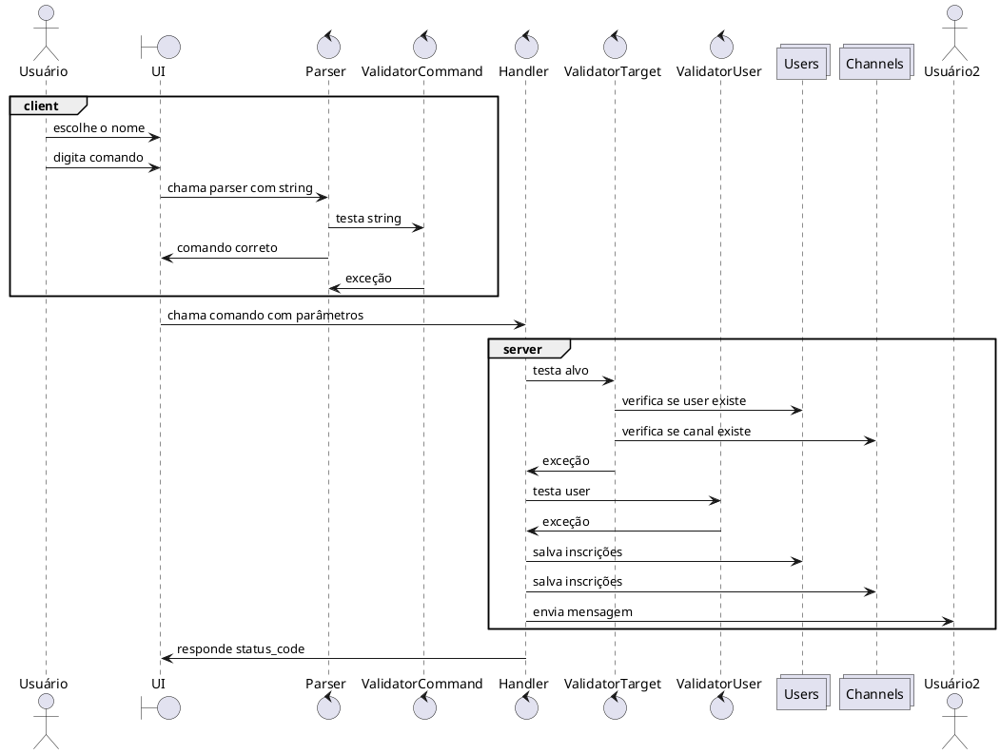

### Nome: Breno Rosa Tomé | DRE: 113026430

# Atividade 1 - Interface e Arquitetura

## Interface da aplicação

Quando o usuário abrir a aplicação, escolherá um nome, caso o nome seja único ele é apresentado a lista de comandos, a interação do usuário com o a aplicação será feita através desses comandos.

- list : lista usuários e canais ativos
- pm user_name/channel_name message : envia mensagem para usuário ou canal
- active : marca o usuário como ativo
- inactive : marca o usuário como inativo
- channel create name : cria um canal com nome enviado
- channel delete name : apaga um canal com enviado
- channel sub name : se inscreve em um canal
- channel unsub name : se desinscreve de um canal

O usuário após definir seu nome e ativar o recebimento de mensagens irá receber as mensagens direcionadas a ele e aos canais em que ele se inscrever


## Arquitetura de software

### Componentes

- ui - loop de interação com o usuário, recebe os inputs
- Parsers - lê a string fornecida pelo usuário e seleciona o comando e os parâmetros adequados e retorna o comando adequado
- Validators :
- - de comando: chamados pelos parsers, verificam se os comandos estão formatados adequadamente
- - de alvo: verificam se um usuário ou canal alvo é válido
- - de usuário: verificam se um nome de usuário é válido
- Handlers - funções que tratam cada comando
- Users: estrutura de dados que armazena as inscrições de cada usuário
- Canais: estrutura de dados que armazena os canais

# Atividade 2 - Arquitetura de sistema

A arquitetura usada será a de cliente servidor, 

### Componentes do servidor
#### Cliente
- Ui
- Parser
- Validator de comando

#### Servidor
- Validador de alvo e usuário
- Handlers
- Users

# Atividade 3 - Protocolo de camada de aplicação

### Tipos de mensagem
requisições:
- Envia json com o comando e recebe confirmação de sucesso ou mensagem de erro em caso de falha
- sintaxe envio
```json
{
    "comando" : "list",
    "params" : []
}
```
```json
{
    "comando" : "pm",
    "params" : ["alvo"]
}
```
```json
{
    "comando" : "channel",
    "params" : ["create", "canal_1"]
}
```
- sintaxe de resposta - vamos usar os mesmos códigos do protocolo http
```json
{
    "status_code" : 200,
    "error" : "",
}
```
- sintaxe de recebimento de mensagem direta
```json
{
    "sender" : "sender_name",
    "message" : "Oi usuário"
}
```
- sintaxe de recebimento de mensagem de canal
```json
{
    "sender" : "sender_name",
    "message" : "Oi usuário",
    "channel" : "channel_name"
}
```


## Diagrama de sequência
